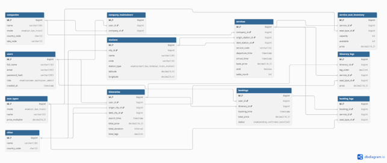

# 🧭 GoBest — Çok Modlu Seyahat Rezervasyon Backend'i

> 🇬🇧 For English: [README.md](README.md)

GoBest, **uçak, otobüs ve tren** seferlerini tek bir arayüzde birleştiren bir seyahat platformunun backend sistemidir. Kullanıcı bir şehirden diğerine arama yaptığında ve direkt sefer yoksa, sistem **aktarmalı rotaları otomatik olarak oluşturur** ve en uygun seçenekleri döndürür.

> Kısaca: Klasik "tek mod, sadece direkt sefer" yaklaşımını; aktarmalı rota üreten, sonuçları cache'leyen ve ölçeklenmeye göre tasarlanmış çok modlu bir sisteme dönüştürür.

---

## 🚀 Neden Bu Proje?

Çoğu rezervasyon sistemi tek bir ulaşım türünü ve yalnızca direkt seferleri ele alır. GoBest'in amacı:

- Uçak / otobüs / tren seferlerini **tek bir listede** birleştirmek
- Direkt sefer yoksa (veya daha ucuzu mümkünse) **aktarmalı rotayı anında oluşturmak**
- Aynı aramayı tekrar tekrar hesaplamak yerine **akıllı cache** kullanmak
- Ölçeklenebilir bir veritabanı tasarımıyla aktif veriyi hafif tutmak

Bu nedenle proje; veri modeli, harici servis entegrasyonu, rota arama algoritması ve booking akışını birlikte ele alan **uçtan uca bir sistem tasarımı**dır.

---

## 🧠 Teknik Olmayanlar İçin Kısa Açıklama

Bir kullanıcı "İstanbul → Berlin" araması yaptığında sistem:

1. O güne ait tüm seferleri toplar (uçak, otobüs, tren)
2. Direkt sefer varsa onu döndürür; yoksa bir **aktarmalı rota** oluşturur (örn. İstanbul → Frankfurt → Berlin)
3. Bu rotaları fiyat / süre / aktarma sayısına göre değerlendirir
4. Aynı arama daha önce yapıldıysa, baştan hesaplamadan **cache'ten anında** döndürür

**Sonuç:** Daha hızlı cevap, gereksiz tekrar hesaplama yok ve büyüdükçe yavaşlamayacak bir yapı.

---

## 🏗️ Mimari Akış

```
[Route API (Python/FastAPI)]  ──►  servis verisi (uçak / otobüs / tren)
            │  (backend periyodik olarak çeker ve DB'ye yazar)
            ▼
┌─────────────────────────────────────────────┐
│              .NET Core Backend               │
│                                              │
│   Arama    ─►  şehir grafiği üzerinde        │
│                kısıtlı BFS  ─►  itinerary    │
│                                              │
│   Rerank   ─►  sonuçlar GoBestModel'e gider, │
│                relevance'a göre sıralanır    │
│                                              │
│   Cache    ─►  üretilen itinerary'ler DB'de  │
│                saklanır, tekrarda oradan     │
│                                              │
│   Booking  ─►  seçilen itinerary             │
│                rezervasyona dönüşür          │
└─────────────────────────────────────────────┘
            │                         │
            ▼                         ▼
     [PostgreSQL]            [GoBestModel — ML servisi]
  itinerary + leg modeli      LightGBM reranking
   (ölçeğe göre tasarlı)      (ayrı repo)
```

- **API Katmanı:** ASP.NET Core (.NET 8)
- **Auth:** JWT + rol bazlı erişim (Customer / Maintainer / Admin)
- **Veritabanı:** PostgreSQL + Entity Framework Core (database-first)
- **Harici Veri:** Route API (Python / FastAPI)
- **ML Reranking:** ayrı servis → [GoBestModel](https://github.com/sahinokdem/GoBestModel)

---

## 👥 Roller

- **Customer** — sefer arar, filtreler, rota detayını görür, bilet alır, geçmiş biletlerini görüntüler
- **Company Maintainer** — kendi şirketinin seferlerini, saatlerini ve koltuk bilgisini yönetir
- **Admin** — maintainer hesapları oluşturur, harici API'den gelen eksik şehir / istasyon / şirket verisini tamamlar

---

## ⚡ Zor Kısımlar ve Mühendislik Çözümleri

### 1) Aktarmalı Rota Üretimi (Sonsuz / Anlamsız Rotalar)

**Problem:** İki şehir arasında direkt sefer her zaman yok, bu yüzden aktarma kurulması gerekiyor — ama naif bir yaklaşım sonsuz ya da anlamsız rotalar üretir (10 bacaklı yolculuklar, ya da önceki bacak varmadan kalkan bağlantılar).

**Çözüm:** Şehir grafiği üzerinde, **gerçek dünya kısıtlarıyla budanmış bir BFS**:

- **En fazla 2 aktarma** (3 bacak) — sonsuz zincirleri engeller
- **Minimum aktarma tamponu** — bir bacağın varışı ile sonraki bacağın kalkışı arasında yeterli süre (gerçekçi bağlantılar)
- **Aynı gün ufku** — tüm rota makul bir zaman penceresine sığmalı
- Bacaklardaki her **koltuk tipi kombinasyonunu** (Eco–Eco, Eco–Bus, …) ayrı seçenek olarak üretir

### 2) Arama Rotalarını Booking'lerden Ayırma

**Problem:** Aynı üretilen rota iki çok farklı rol üstlenir. Bir *arama sonucu* olarak gereksizdir — kimse satın almazsa, tarihi geçince sadece çöptür. Bir *satın alma* olarak ise kullanıcının geçmişi için saklanmalıdır. İkisini aynı şekilde ele almak, ya veritabanını ölü arama verisiyle şişirir ya da gerçek booking'leri kaybetme riski doğurur.

**Çözüm:** Model bunu, her `service` üzerindeki bir `sold` flag'ine dayanan, ömürleri farklı iki yapıya böler:

- **Itinerary + ItineraryLegs** → üretilen/cache'lenen bir arama sonucu. `Itinerary` özeti tutar (toplam fiyat, süre, aktarma sayısı); her `ItineraryLeg` bir bacağı tutar (sıra, servis, koltuk tipi, fiyat). Tekrarlı aramalarda cache'lenip yeniden sunulur.
- **Booking + BookingLegs** → bir satın alma. `Booking` üretildiği itinerary'ye referans verir, her `BookingLeg` satın alınan bacağı (servis, koltuk tipi) kaydeder.

Her şeyi birbirine bağlayan, yaşam döngüsü kuralıdır:

- **Hiç satılmamış** bir servis (`sold = false`) ve ondan üretilen itinerary/leg'ler, **tarihi geçince silinir** — ölü arama verisi birikmez.
- **Satılmış** bir servis (`sold = true`) ve ona bağlı itinerary, leg ve booking, canlı oldukça **asla silinmez**. Bir booking her zaman satılmış bir servisi ima ettiği için, arkasındaki itinerary hiçbir zaman silme hedefi olmaz — yani kullanıcının geçmişi, hiçbir cascade hilesine gerek kalmadan korunur.

`BookingLeg`'in kendi `service` ve `seat_type` referanslarını tutmasının sebebi de budur: bir booking kendi kendini tanımlar, arama tarafındaki kayıtların hayatta kalmasına bağlı değildir.

**Fiyat neden itinerary'de, booking leg'de değil:** bacak başına fiyat `ItineraryLeg` üzerinde durur; booking ise anlaşılan toplamı `Booking.TotalPrice`'ta saklar. Bu, fiyatı iki yerde tekrarlamayı önler ve booking leg'i *neyin* satın alındığına (servis + koltuk tipi) odaklı tutar.

### 3) Tekrarlı Hesaplama (Performans)

**Problem:** Aynı popüler rotayı (örn. İstanbul–Ankara) yüzlerce kullanıcı arıyor. Her seferinde baştan birleştirmek israf.

**Çözüm:** **Cache-aside** stratejisi. Üretilen itinerary'ler DB'ye yazılır; aynı rota + tarih tekrar arandığında, yeniden birleştirme yapılmadan doğrudan DB'den döner. Hedef: **arama ≤ 3 saniye**.

### 4) Dinamik Fiyatlama ve Koltuk Müsaitliği

**Problem:** Çok bacaklı bir rotada her servisin farklı koltuk tipleri ve fiyat çarpanları var; ayrıca istenen yolcu sayısı kadar boş koltuk olmalı.

**Çözüm:** Fiyat dinamik hesaplanır (taban fiyat × yolcu sayısı, koltuk tipi çarpanıyla). Sonuçlar döndürülmeden önce, istenen yolcu sayısına göre **koltuk müsaitliği doğrulanır**, böylece geçersiz seçenekler gösterilmez.

### 5) Sadece Fiyattan Daha Akıllı Sıralama

**Problem:** Sadece en düşük fiyata göre sıralamak, kullanıcının gerçekte önemsediği şeyleri (süre, aktarma, şirket, geçmiş davranış) görmezden gelir.

**Çözüm:** Arama sonuçları ayrı bir ML servisine, [GoBestModel](https://github.com/sahinokdem/GoBestModel)'e gönderilir; bu servis, etkileşim özellikleri (tıklama / booking) üzerine eğitilmiş bir LightGBM modeli ile sonuçları **tahmini relevance'a göre yeniden sıralar**.

---

## 📈 Ölçeklenmeye Göre Tasarım

Sistem, veritabanı katmanından itibaren büyümeyi düşünerek tasarlandı. Her servisteki `sold` flag'i, satın alınan her şeyi koruyup aktif veritabanını küçük tutan iki yönlü bir veri yaşam döngüsünü yönetir.



Şema buna göre kurgulandı; temizlik ve partitioning işlerinin kendisi bir sonraki implementasyon fazı (tasarlandı, henüz yapılmadı):

- **Database-first tasarım:** Şema, ilişkiler ve kısıtlar uygulama mantığından önce modellendi; indeksleme ve sorgu şekli baştan düşünüldü.
- **Satılmamış verinin temizlenmesi (planlandı):** Tarihi geçmiş satılmamış servisler — ve onlardan üretilen itinerary/leg'ler — otomatik silinecek şekilde tasarlandı; ölü arama verisi sıcak tablolarda birikmesin diye.
- **Satılmış veri için partitioning (planlandı):** Satılmış servisler ve onlara bağlı her şey (itinerary, legs, booking) partitioning ile sıcak yoldan çıkarılıp, uzun bir saklama süresi (örn. 1–3 yıl) sonunda tamamen silinecek şekilde tasarlandı.

Buradaki amaç baştan sona performans ve disk verimliliği: canlı veriyi yalnızca gerçekten aktif olanla sınırlamak, satın alınanı arşivlemek, çok eskiyi de zamanla tasfiye etmek.

---

## 🧩 Modül Yapısı

```
Auth/        – kimlik doğrulama & JWT
Users/       – kullanıcı hesapları & roller
Companies/   – ulaşım şirketleri
Stations/    – şehirler & istasyonlar
Routes/      – harici servis verisi & çekme
Itinaries/   – rota arama (BFS) & itinerary üretimi
Seats/       – koltuk tipleri & envanter
Bookings/    – rezervasyonlar
```

---

## 🛠️ Lokal Kurulum

```bash
dotnet restore
dotnet ef database update
dotnet run
```

Veritabanı bağlantısını ve Route API adresini `appsettings.Development.json` içinde yapılandır.
